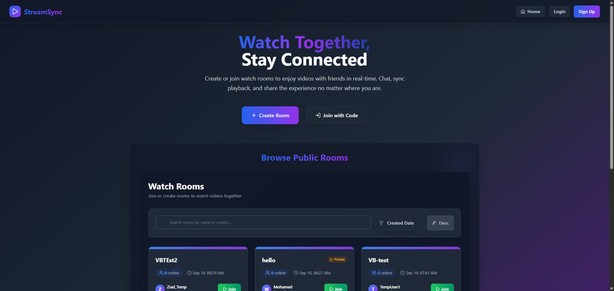

# 🎬 StreamSync


## Description

StreamSync is a collaborative platform for hosting real-time watch parties, enabling users to create interactive rooms where they can watch YouTube videos, chat, and share control with friends. Featuring advanced video synchronization, live chat, user management, and a unique Virtual Browser powered by Docker/Neko for shared browsing experiences. The backend is built with ASP.NET Core, while the frontend leverages React and TypeScript for a seamless, modern user experience.

## 🖥️ Virtual Browser Feature (Neko)

StreamSync now supports a **Virtual Browser** feature powered by [Neko](https://github.com/m1k1o/neko) running in Docker containers. This allows users to request a shared browser session for collaborative browsing, streaming, or remote control directly from the app.

### Key Capabilities
- **Request a Virtual Browser**: Room admins/controllers can request a browser session for their room.
- **Queue System**: If all browsers are busy, rooms are placed in a queue and notified when a browser becomes available.
- **WebRTC Streaming**: Real-time audio/video streaming using Neko's WebRTC.
- **Session Management**: Automatic allocation, expiration, and cleanup of browser sessions.
- **Remote Control**: Interact with the browser (mouse, keyboard, navigation) from the app UI.

### Backend Services Overview
- `VirtualBrowserController`: API endpoints for requesting, controlling, and managing virtual browser sessions.
- `NekoVirtualBrowserService`: Core logic for allocating containers, session lifecycle, and integration with Neko.
- `VirtualBrowserQueueService`: Handles queuing, notifications, and room queue status.
- `VirtualBrowserStartupService`: Initializes the browser pool on backend startup.
- `VirtualBrowserMaintenanceService`: Background service for session expiration and notification processing.
- DTOs and Models: `VirtualBrowserDto`, `VirtualBrowserRequestDto`, `VirtualBrowserControlDto`, etc.


> **Note:** You can scale the number of Neko containers for more concurrent browser sessions. Update backend configuration accordingly.

### How to Use
1. **Room admin/controller requests a Virtual Browser** via the app UI.
2. If available, a browser session is allocated and a WebRTC stream URL is provided.
3. If busy, the room is queued and notified when a browser is free.
4. Participants can interact with the browser (mouse, keyboard, navigation).
5. Sessions expire after a set duration (e.g., 3 hours) and are automatically cleaned up.

For more details, see the backend services in `StreamSync/StreamSync/Services/` and API endpoints in `VirtualBrowserController`.

## ✨ Features

### 🎥 Video Synchronization
- **Real-time playback control**: Play, pause, and seek videos in perfect sync across all participants
- **YouTube integration**: Search and play YouTube videos directly within the app
- **Video URL support**: Paste YouTube URLs to instantly load videos
- **Smart synchronization**: Automatic position syncing with minimal latency and outlier detection
- **Heartbeat system**: Continuous position monitoring for seamless synchronization
- **Force sync**: Automatic sync correction for participants who fall out of sync

### 🏠 Room Management
- **Create public/private rooms**: Host watch parties with customizable privacy settings
 - **Create public/private rooms**: Host StreamSync rooms with customizable privacy settings
- **Room passwords**: Secure private rooms with password protection
- **Invite codes**: Easy room sharing with unique invite codes
- **Participant management**: View active participants with avatar support
- **Admin controls**: Room creators can close rooms and manage all aspects
- **Auto cleanup**: Rooms automatically clean up when empty
- **Room state persistence**: Maintains video state and participant list

### 💬 Real-time Chat
- **Live messaging**: Chat with other participants during video playback
- **User identification**: See who's talking with display names and avatars
- **Message history**: Persistent chat history that loads when joining rooms
- **System messages**: Automated notifications for user joins/leaves/kicks
- **Instant delivery**: Real-time message delivery via SignalR

### 🔐 User Authentication
- **Secure registration/login**: JWT-based authentication system
- **User profiles**: Display names, avatars, and account management
- **Password reset**: Email-based password recovery
- **Session management**: Secure token-based sessions with automatic reconnection

### 👥 User Management
- **Control transfer**: Admins and controllers can transfer playback control to other participants
- **Auto control assignment**: First participant or admin automatically gets control
- **Kick functionality**: Room admins can remove disruptive participants
- **Admin privileges**: Room creators have elevated permissions
- **Participant notifications**: Real-time updates when users join/leave

### 🎮 Interactive Controls
- **Smart control system**: Only controllers and admins can manage playback
- **Video changing**: Controllers can switch videos during the session
- **Join notifications**: Welcome messages when participants enter
- **Leave handling**: Graceful control transfer when controllers leave
- **Responsive design**: Works seamlessly on desktop and mobile

## 🛠️ Tech Stack

### Backend (.NET 8)
- **ASP.NET Core Web API**: RESTful API endpoints
- **SignalR**: Real-time communication hub
- **Entity Framework Core**: Database ORM with SQL Server
- **JWT Authentication**: Secure token-based auth
- **Google YouTube API v3**: Video search and metadata
- **BCrypt**: Password hashing
- **MailKit**: Email services

### Frontend (React 18)
- **React with TypeScript**: Type-safe component development
- **TailwindCSS**: Utility-first styling
- **SignalR Client**: Real-time connection management
- **React Router**: Client-side routing
- **Axios**: HTTP client for API calls
- **React Hot Toast**: User notifications

## 📋 Prerequisites

- **.NET 8 SDK**: [Download here](https://dotnet.microsoft.com/download/dotnet/8.0)
- **Node.js 16+**: [Download here](https://nodejs.org/)
- **SQL Server**: LocalDB, Express, or full SQL Server
- **YouTube API Key**: [Get from Google Cloud Console](https://console.cloud.google.com/)
- **Docker**: Required for running the Virtual Browser (Neko) containers. [Download Docker](https://www.docker.com/products/docker-desktop)

## 🚀 Installation & Setup

### 1. Clone the Repository
```bash
git clone https://github.com/ZiadHesham225/StreamSync.git
cd StreamSync
```

### 2. Backend Setup
```bash
cd StreamSync/StreamSync

# Restore NuGet packages
dotnet restore

# Update appsettings.json with your configuration
# - Database connection string
# - JWT secret and settings
# - YouTube API key
# - Email SMTP settings

# Apply database migrations
dotnet ef database update

# Run the backend
dotnet run
```

### 3. Frontend Setup
```bash
cd ../streamsync-ui

# Install npm dependencies
npm install

# Start the development server
npm start
```

### 4. Configuration

Update `StreamSync/appsettings.json`:
```json
{
  "ConnectionStrings": {
    "DefaultConnection": "Server=(localdb)\\mssqllocaldb;Database=StreamSyncDb;Trusted_Connection=true;"
  },
  "JWT": {
    "ValidIssuer": "https://localhost:7000",
    "ValidAudience": "https://localhost:3000",
    "Secret": "your-super-secret-jwt-key-here"
  },
  "YouTube": {
    "ApiKey": "your-youtube-api-key"
  },
  "EmailSettings": {
    "SmtpServer": "smtp.gmail.com",
    "SmtpPort": 587,
    "SmtpUsername": "your-email@gmail.com",
    "SmtpPassword": "your-app-password"
  }
}
```

## 🎯 Usage

1. **Register/Login**: Create an account or sign in
2. **Create Room**: Start a new StreamSync room (public or private)
3. **Invite Friends**: Share the room invite code
4. **Select Video**: Search YouTube or paste video URLs
5. **Watch Together**: Enjoy synchronized playback with real-time chat
6. **Manage Room**: Transfer control, kick users (admin), or close room

## 🤝 Contributing

We welcome contributions! Here's how to get started:

### 1. Fork & Clone
```bash
git fork https://github.com/ZiadHesham225/StreamSync.git
git clone https://github.com/your-username/StreamSync.git
```

### 2. Create Feature Branch
```bash
git checkout -b feature/amazing-feature
```

### 3. Make Changes
- Follow existing code style and conventions
- Add comments for complex logic
- Update documentation if needed

### 4. Submit Pull Request
- Write clear commit messages
- Include description of changes
- Reference any related issues

---

⭐ **Star this repo if you found it helpful!** ⭐
